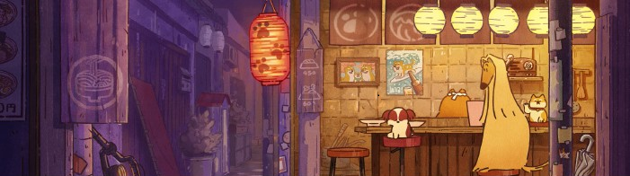

  

 

<h3>Frontend Developer | Backend Developer</h3>

 

  
- 💼 I’m currently working on <a style="" href="https://github.com/tuananhhdev/Topzone-MERN">Topzone-MERN</a>

- 🌱 I’m currently learning **Backend**

- ❓ Ask me about **JavaScript, React, Node.js, MongoDB, and RESTful APIs**

- 📫 How to reach me **tuananhhdev@gmail.com**

- ⚡ Fun fact **I think i'm handsome 😅**

###

<!--   
  
  
  
  
   -->

###

 

###

<picture>
  <source media="(prefers-color-scheme: dark)" srcset="https://raw.githubusercontent.com/tuananhhdev/tuananhhdev/output/pacman-contribution-graph-dark.svg">
  <source media="(prefers-color-scheme: light)" srcset="https://raw.githubusercontent.com/tuananhhdev/tuananhhdev/output/pacman-contribution-graph.svg">
  
</picture>

 

## 👁‍🗨 Profile Views

 

## 🌐 Socials 

 

## 💻 Languages and Tools 
- ### Front - End

- ### Back - End

- ### Databases

- ### ORM

- ### Tools

 

## 🏆 GitHub Trophies

          
 

## 🔝 Top Contributed Repo

 

## 📊 GitHub Stats:
  
  

 

## ✍️ Dev Quote

 

